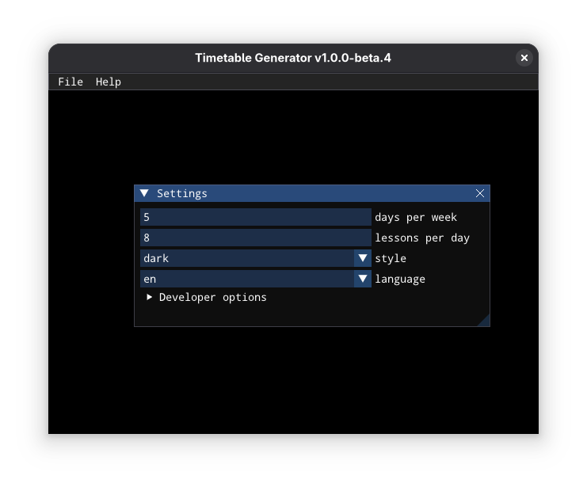
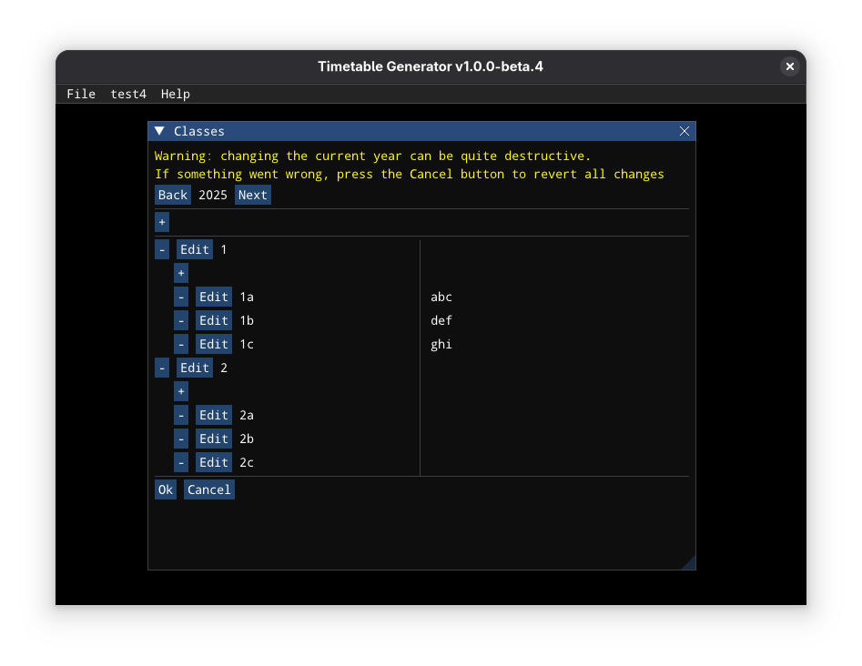
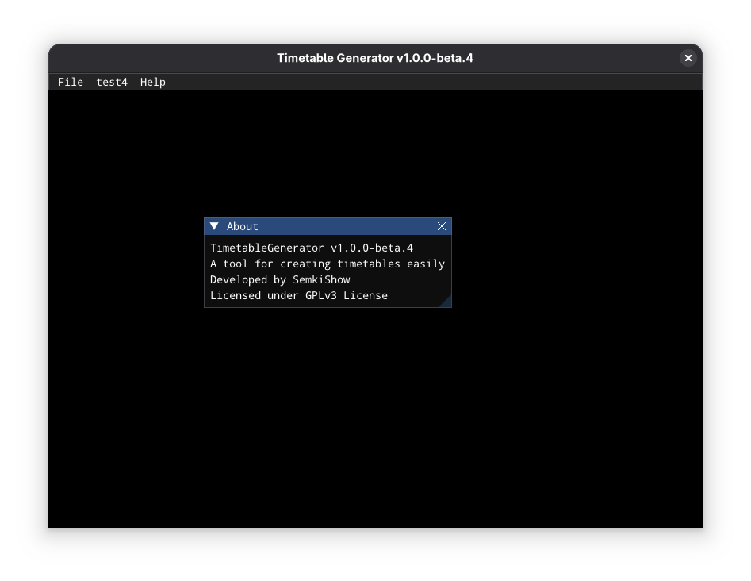

# Timetable Generator

<p float="left">
  
   
  
</p>

A tool for creating timetables easily

<details>
<summary>Polski</summary>

# Generator Planów Lekcji

Narzędzie do łatwego tworzenia planów lekcji

## Jak uruchomić

- Pobierz najnowszą wersję
- Rozpakuj plik
- Uruchom `TimetableGenerator` lub `TimetableGenerator.exe` w zależności od systemu

## Jak zbudować

1. Zainstaluj Raylib korzystając z jednego z tych poradników w zależności od systemu: [Linux](https://github.com/raysan5/raylib/wiki/Working-on-GNU-Linux), [Windows](https://github.com/raysan5/raylib/wiki/Working-on-Windows), [macOS](https://github.com/raysan5/raylib/wiki/Working-on-macOS)
1. Uruchom:
```
chmod +x run.sh
./run.sh
```

</details>

<details>
<summary>Беларуская</summary>

# Генератар Раскладу

Інструмент для лёгкага стварэння раскладаў

## Як запусціць

- Спампуйце апошнюю версію
- Распакуйце архіў
- Запусціце `TimetableGenerator` або `TimetableGenerator.exe` у залежнасці ад вашай сістэмы

## Як сабраць

1. Усталюйце Raylib, выкарыстоўваючы адзін з гэтых дапаможнікаў у залежнасці ад вашай сістэмы: [Linux](https://github.com/raysan5/raylib/wiki/Working-on-GNU-Linux), [Windows](https://github.com/raysan5/raylib/wiki/Working-on-Windows), [macOS](https://github.com/raysan5/raylib/wiki/Working-on-macOS)
1. Выканайце:
```
chmod +x run.sh
./run.sh
```

</details>

<details>
<summary>Русский</summary>

# Генератор Расписания

Инструмент для простого создания расписаний

## Как запустить

- Скачайте последнюю версию
- Распакуйте архив
- Запустите `TimetableGenerator` или `TimetableGenerator.exe` в зависимости от вашей системы

## Как собрать

1. Установите Raylib, следуя одному из этих руководств в зависимости от вашей системы: [Linux](https://github.com/raysan5/raylib/wiki/Working-on-GNU-Linux), [Windows](https://github.com/raysan5/raylib/wiki/Working-on-Windows), [macOS](https://github.com/raysan5/raylib/wiki/Working-on-macOS)
1. Выполните:
```
chmod +x run.sh
./run.sh
```

</details>

## How to run

- Download the latest release
- Unzip it
- Run TimetableGenerator or TimetableGenerator.exe depending on your system

## How to build

1. Install Raylib following one of these tutorials based on your system: [Linux](https://github.com/raysan5/raylib/wiki/Working-on-GNU-Linux), [Windows](https://github.com/raysan5/raylib/wiki/Working-on-Windows), [macOS](https://github.com/raysan5/raylib/wiki/Working-on-macOS)
1. Run
```
chmod +x run.sh
./run.sh
```

