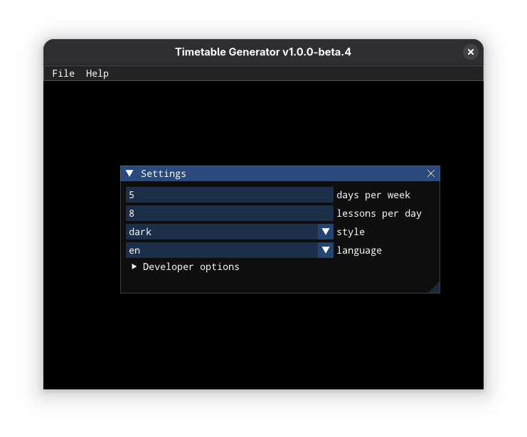
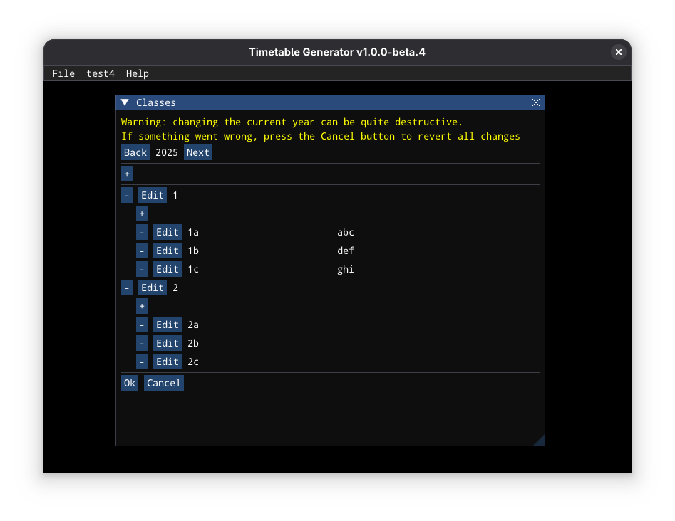
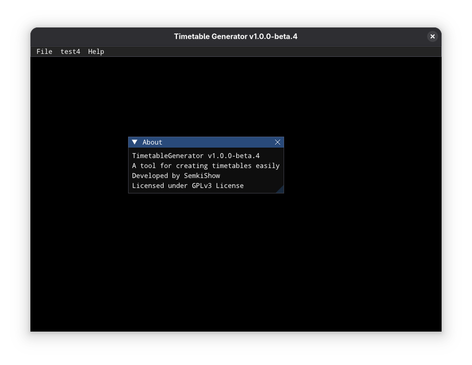

# Timetable Generator

<p float="left">
  
  
  
</p>

A tool for creating timetables easily

## How to run

- Download the latest release
- Unzip it
- Run TimetableGenerator or TimetableGenerator.exe depending on your system

## How to build

1. If on Linux, install raylib's dependencies following [this tutorial](https://github.com/raysan5/raylib/wiki/Working-on-GNU-Linux#dependencies)
2. You'll need a C/C++ compiler, Git and CMake
3. Run 
```bash
git clone https://github.com/SemkiShow/TimetableGenerator
cd TimetableGenerator
git submodule update --init --recursive --depth 1
chmod +x run.sh
./run.sh
```
